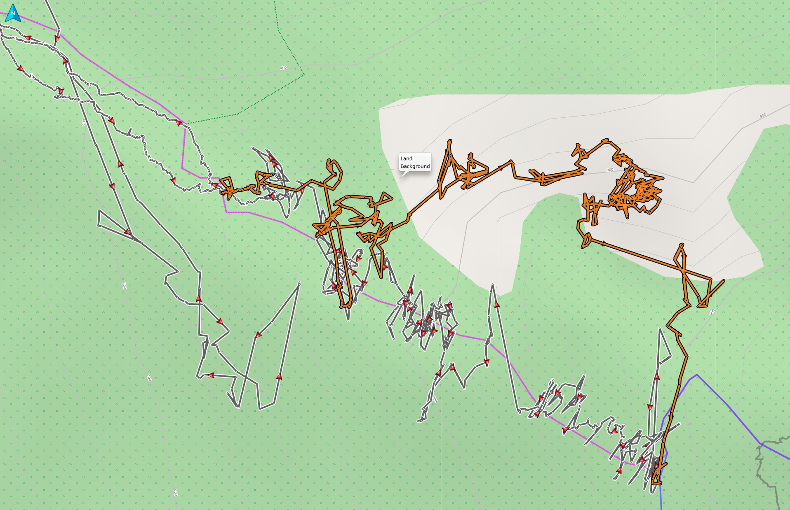
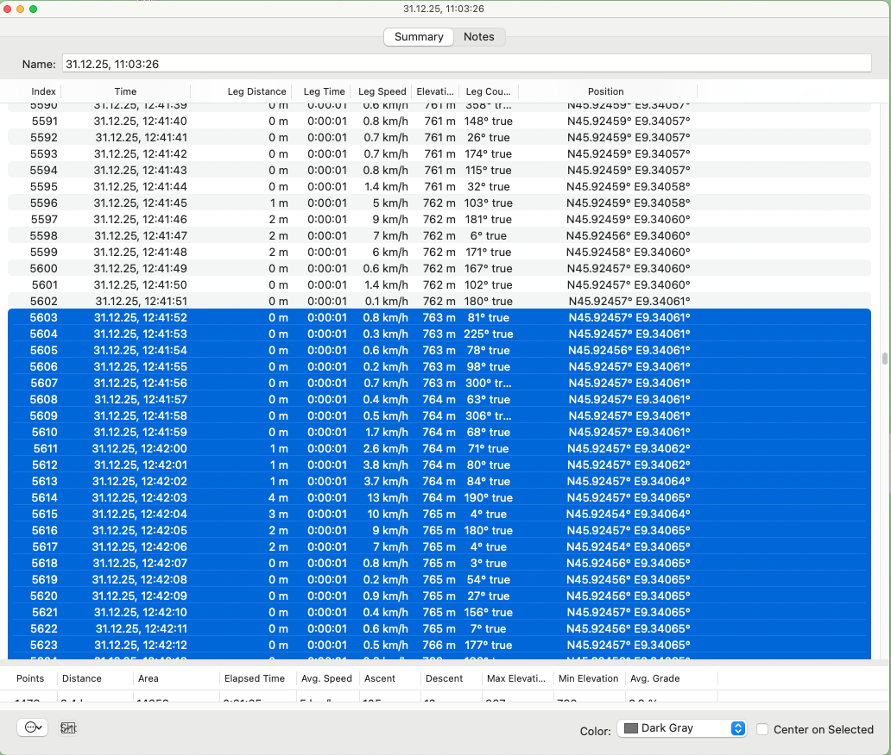
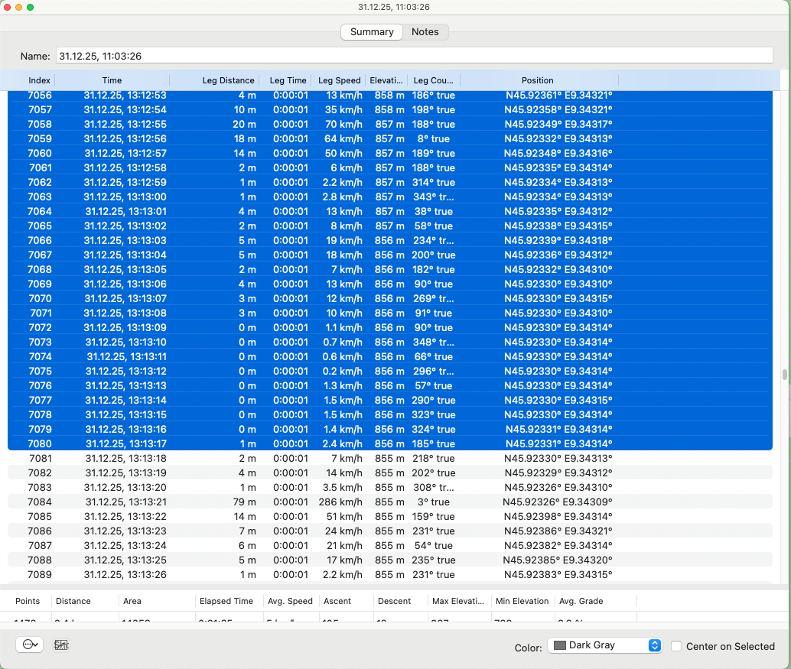
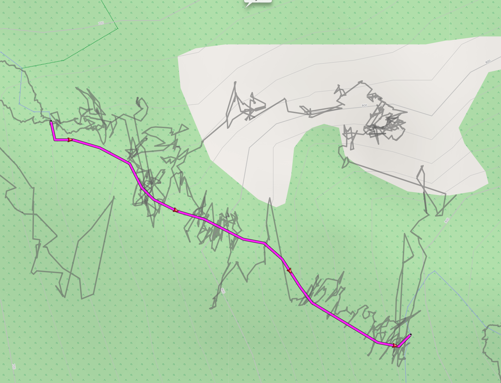
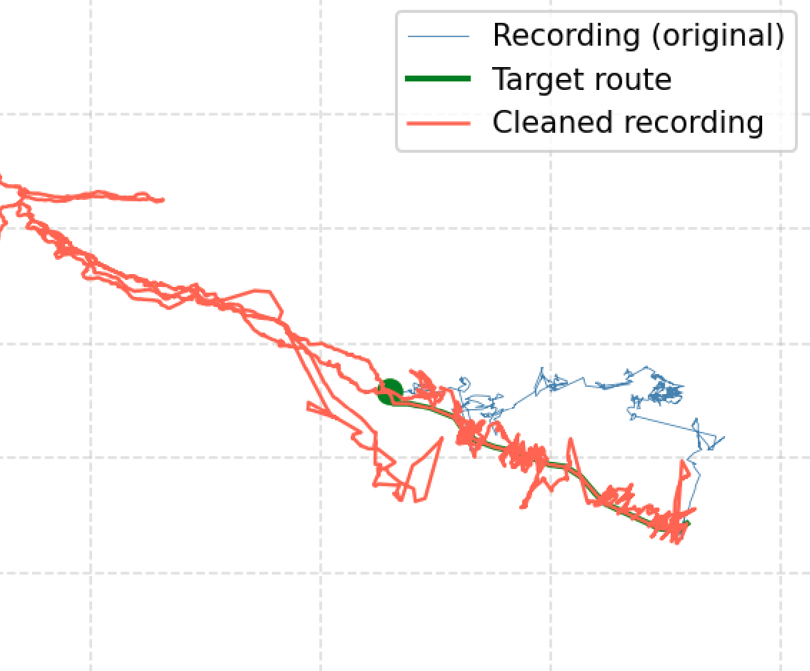
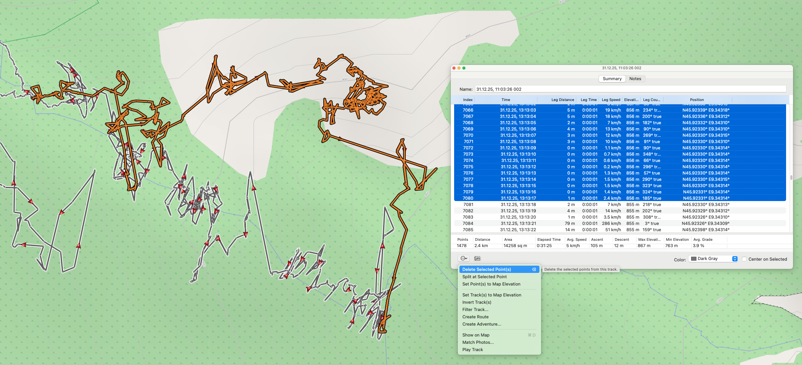
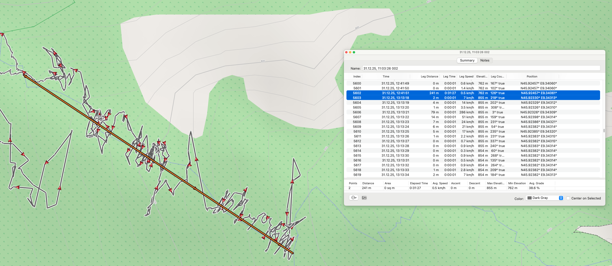
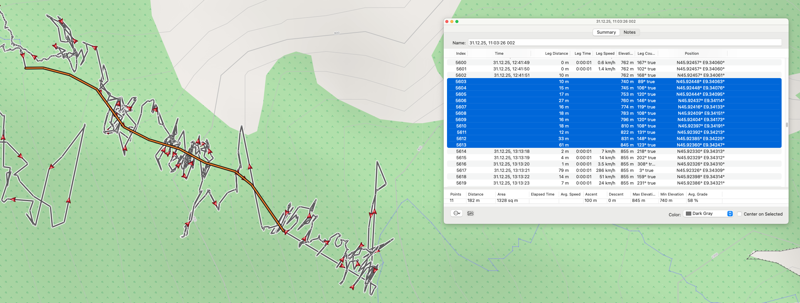
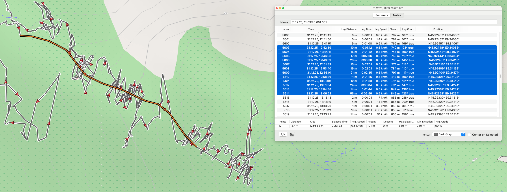
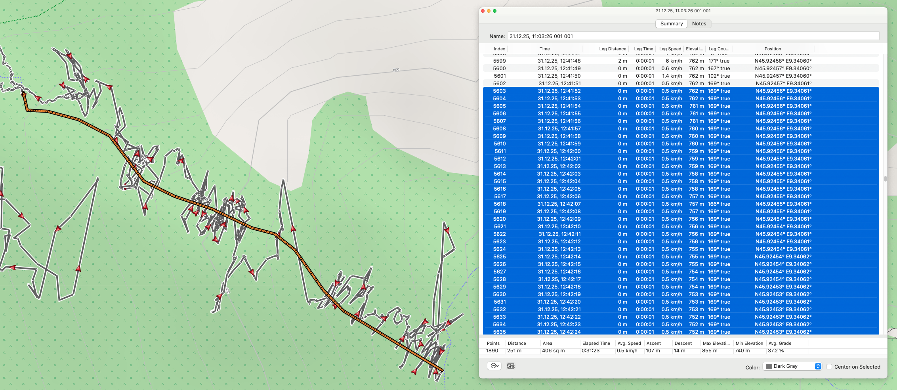

# GPSCleaner

Corrects GPS recordings where track points deviate from the actual route during a given time window. The affected points are replaced by positions evenly distributed along the actual route. The original file is left unchanged; the result is written to a new file. Also, you can reduce sample rate and point density by distance, and compare two tracks to measure deviations over time.

## Example

### With clean

The highlighted section of the GPS track is intended to follow the actual route, which can be seen in magenta in the background:



Determine the start and end times of the highlighted section. Here in Garmin BaseCamp:




Create and export a GPS track of the actual route:



The GPS track must correspond to the section that is to serve as a reference for all original positions from the start to the end time. The original GPS points are evenly distributed along this track.

And here is the corrected section:




### With retime

The points in the highlighted sections will be removed (again in Garmin BaseCamp):





The actual route is reconstructed by adding new points through dragging:



After exporting the modified route as a GPX file, the points are timestamped using `retime`:



Or, using `retime --sample-rate 1`, additional points are added at the recording’s sample rate:




## Restrictions

Of course, the result is only an estimate, but the more evenly (constant speed) the route was covered, the more accurate it will be. It should not include interruptions such as breaks or red lights. It is equally important that the start and end points of the sections to be corrected are actually located where you were at that time, and not simply the result of an inaccurate measurement. Time-lapse photos or video footage containing a feature that allows their position on the map to be clearly identified can be helpful. In the GPS track, the point with the same timestamp as the photo or frame can then be moved to the correct position in, for example, Garmin BaseCamp, and serve as the start or end point of a section.


## Requirements

Both GPS files must be in **GPX 1.1** format (`xmlns="http://www.topografix.com/GPX/1/1"`). This format is exported by Garmin devices and Garmin BaseCamp, among others.

## Installation

In the project directory:

```bash
python -m venv .venv
source .venv/bin/activate
pip install -e .
```

## Starting GPSCleaner

GPSCleaner runs inside a Python virtual environment (`.venv`). The environment must be activated once per terminal session before any `python -m gpscleaner` command will work:

```bash
source /path/to/GPSCleaner/.venv/bin/activate
```

You do not need to change into the project directory first — the full path to `activate` is enough. After activation, `python -m gpscleaner` works from any directory as long as you provide full paths to your GPX files.

The activation applies only to the current terminal session. Open a new terminal window and you need to run `source … activate` again.

Alternatively, without activating the environment:

```bash
/path/to/GPSCleaner/.venv/bin/python -m gpscleaner clean --recording ...
```

## Usage

GPSCleaner provides three subcommands: `clean`, `compare` and `retime`.

### clean — Correct or reduce a track

#### By timestamp

```
python -m gpscleaner clean --recording FILE --start TIME --end TIME --reference FILE [--plot]
```

| Option          | Description |
|-----------------|-------------|
| `--recording`   | GPX file containing the recording with deviations |
| `--start`       | Time when the recording begins to deviate (UTC, ISO 8601) |
| `--end`         | Time when the recording returns to the actual route (UTC, ISO 8601) |
| `--reference`   | GPX file containing the actual route for the given time window |
| `--plot`        | Also save a PNG visualisation of the tracks (optional) |

Times must be given in UTC. Garmin BaseCamp displays times in local time — please convert accordingly.

```bash
python -m gpscleaner clean \
  --recording /path/to/recording.gpx \
  --start 2026-03-22T15:06:08Z \
  --end   2026-03-22T15:30:50Z \
  --reference /path/to/reference.gpx
```

#### By track point index

For high sample-rate recordings (e.g. dashcams at 25 fps), timestamps are only displayed to the nearest second in Garmin BaseCamp, which is too imprecise. Use track point indices instead:

```
python -m gpscleaner clean --recording FILE --start-point N --end-point N --reference FILE [--plot]
```

| Option          | Description |
|-----------------|-------------|
| `--recording`   | GPX file containing the recording with deviations |
| `--start-point` | Index of the first deviating track point (1 = first point) |
| `--end-point`   | Index of the last deviating track point (1 = first point) |
| `--reference`   | GPX file containing the actual route for the given time window |
| `--plot`        | Also save a PNG visualisation of the tracks (optional) |

```bash
python -m gpscleaner clean \
  --recording /path/to/recording.gpx \
  --start-point 1250 \
  --end-point   3400 \
  --reference /path/to/reference.gpx
```

`--start-point`/`--end-point` and `--start`/`--end` cannot be combined.

#### By GPS coordinate

GPS coordinates can be used to identify the start and end point directly:

```
python -m gpscleaner clean --recording FILE --start-coord LAT,LON --end-coord LAT,LON --reference FILE [--plot]
```

| Option          | Description |
|-----------------|-------------|
| `--recording`   | GPX file containing the recording with deviations |
| `--start-coord` | Coordinate of the first deviating track point (`LAT,LON`) |
| `--end-coord`   | Coordinate of the last deviating track point (`LAT,LON`) |
| `--reference`   | GPX file containing the actual route for the given window |
| `--plot`        | Also save a PNG visualisation of the tracks (optional) |

```bash
python -m gpscleaner clean \
  --recording /path/to/recording.gpx \
  --start-coord 45.924565242603421,9.340607235208154 \
  --end-coord   45.923309549689293,9.343135720118880 \
  --reference /path/to/reference.gpx
```

Coordinates must match a track point in `--recording` exactly. In JOSM's "Advanced object info" window coordinates are displayed in the format `45.9245652, 9.3406072` — remove the space after the comma to get `45.9245652,9.3406072`. The coordinate must be unique within the track; if it occurs more than once (e.g. a looping route), an error is raised.

`--start-coord`/`--end-coord` cannot be combined with `--start`/`--end` or `--start-point`/`--end-point`.

#### Reduce sample rate

Some GPS devices (e.g. dashcams) record at a very high sample rate. Use `--sample-rate` to reduce the number of positions per second:

```
python -m gpscleaner clean --recording FILE --sample-rate RATE [--plot]
```

| Option          | Description |
|-----------------|-------------|
| `--recording`   | GPX file to be reduced |
| `--sample-rate` | Target number of positions per second (decimals allowed, e.g. `0.2` for one position every 5 seconds) |
| `--plot`        | Also save a PNG visualisation of the tracks (optional) |

```bash
python -m gpscleaner clean --recording /path/to/recording.gpx --sample-rate 1
```

If the recording's current sample rate is already at or below the target, a message is printed and no output file is created.

`--sample-rate` cannot be combined with `--start`, `--end`, or `--reference`.

#### Reduce point density by distance

Use `--distance` to remove points so that consecutive kept points are at least a given distance apart:

```
python -m gpscleaner clean --recording FILE --distance METRES [--plot]
```

| Option          | Description |
|-----------------|-------------|
| `--recording`   | GPX file to be reduced |
| `--distance`    | Minimum distance in metres between consecutive points (decimals allowed, e.g. `2.5`) |
| `--plot`        | Also save a PNG visualisation of the tracks (optional) |

```bash
python -m gpscleaner clean --recording /path/to/recording.gpx --distance 3
```

A point is removed only if the next point (after removal) would still be within the threshold distance of the current anchor, so no gap exceeds the threshold. Points are never added; sections already sparser than the threshold remain unchanged. If no points can be removed, a message is printed and no output file is created.

`--distance` cannot be combined with `--start`, `--end`, `--start-point`, `--end-point`, `--start-coord`, `--end-coord`, `--reference`, or `--sample-rate`.

#### Output files

All `clean` modes write the result next to `--recording`:

```
recording.gpx  →  recording_cleaned.gpx              (track correction)
               →  recording_cleaned.png               (with --plot)
               →  recording_sample-rate=1.0.gpx       (--sample-rate 1)
               →  recording_distance=3.0.gpx          (--distance 3)
```

### compare — Measure deviations between two tracks

Compares two GPS tracks by matching points with similar timestamps and printing their distances:

```
python -m gpscleaner compare --recording FILE --reference FILE --max-time-diff SECONDS [--interval SECONDS]
```

| Option            | Description |
|-------------------|-------------|
| `--recording`     | GPX recording to compare against the reference |
| `--reference`     | Reference GPS track (drives the comparison) |
| `--max-time-diff` | Maximum time difference in seconds between matched points (interpreted as ±) |
| `--interval`      | Check every this many seconds (optional; all reference points are compared if omitted) |

```bash
python -m gpscleaner compare \
  --recording /path/to/recording.gpx \
  --reference /path/to/reference.gpx \
  --max-time-diff 2

python -m gpscleaner compare \
  --recording /path/to/recording.gpx \
  --reference /path/to/reference.gpx \
  --max-time-diff 2 --interval 60
```

Output is a table printed to the terminal (redirectable with `>`):

```
Timestamp (Reference)             Distance (m)   Timestamp (Original)
2026-03-22T15:06:08+00:00                 3.41   2026-03-22T15:06:08+00:00
2026-03-22T15:07:08+00:00                12.87   2026-03-22T15:07:09+00:00
2026-03-22T15:08:08+00:00
```

A row with no match within `--max-time-diff` has empty distance and timestamp columns.

### retime — Assign timestamps to points without one

Some GPS tracks contain sections where track points have no timestamp. This happens,
for example, when points are manually deleted in Garmin BaseCamp and replaced with
new points drawn along the actual route. `retime` assigns timestamps to these
points based on their distance from the surrounding timestamped points, assuming
constant speed throughout each affected section.

```
python -m gpscleaner retime --recording FILE [--overwrite] [--sample-rate RATE]
```

| Option          | Description |
|-----------------|-------------|
| `--recording`   | GPX file containing track points without timestamps |
| `--overwrite`   | Overwrite the recording in place instead of creating a new file (optional) |
| `--sample-rate` | Insert additional points in gap sections so that consecutive points are at most 1/RATE seconds apart (optional) |

```bash
python -m gpscleaner retime --recording /path/to/recording.gpx

python -m gpscleaner retime --recording /path/to/recording.gpx --sample-rate 25
```

The first and last track points of the recording must have timestamps; otherwise
processing is aborted with an error message. If no points without timestamps are
found, a message is printed and no output file is created.

With `--sample-rate`, additional track points are inserted within gap sections by
linear interpolation of position and evenly spaced timestamps. Existing gap points
are always kept. If the time between two consecutive gap points is already shorter
than 1/RATE seconds, no new points are inserted between them.

`--plot` is not supported (coordinates are not changed) and results in an error.

Without `--overwrite`, the result is written next to the recording:

```
recording.gpx  →  recording_retimed.gpx
```

`--overwrite` is useful when `retime` needs to be applied to multiple sections of
the same file in succession: run the command once per section, each time overwriting
the result of the previous run.

## Plot

With `--plot`, an additional PNG file is created. For track correction it shows the original recording (blue), reference route (green), and cleaned track (red). For sample rate reduction it shows the original (blue) and the reduced track (red).


