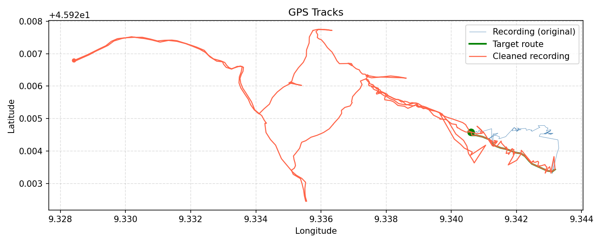

# GPSCleaner

Corrects GPS recordings where track points deviate from the actual route during a given time window. The affected points are replaced by positions evenly distributed along a reference route. The original file is left unchanged; the result is written to a new file.

## Example

The highlighted section of the GPS track is intended to follow the actual route, which can be seen in magenta in the background: 


Determine the start and end times of the highlighted section. Here in Garmin BaseCamp:


Create and export a GPS track of the actual route:


The GPS track must correspond exactly to the section that is to serve as a reference for all original positions from the start to the end time. The original GPS points are evenly distributed along this track.

And here is the corrected section:


Of course, the result is only an estimate, but the more evenly the route was covered, the more accurate it will be. It should not include interruptions such as breaks or red lights. Nor should it include U-turns, where the route suddenly heads back in the opposite direction.

## Requirements

Both GPS files must be in **GPX 1.1** format (`xmlns="http://www.topografix.com/GPX/1/1"`). This format is exported by Garmin devices and Garmin BaseCamp, among others.

## Installation

```bash
python -m venv .venv
source .venv/bin/activate
pip install -e .
```

## Usage

### Correct a deviated track

The deviation window can be specified either by **timestamps** or by **track point indices**.

#### By timestamp

```
python -m gpscleaner --orig FILE --start TIME --end TIME --reference FILE [--plot]
```

| Option        | Description |
|---------------|-------------|
| `--orig`      | GPX file containing the recording with deviations |
| `--start`     | Time when the recording begins to deviate (UTC, ISO 8601) |
| `--end`       | Time when the recording returns to the actual route (UTC, ISO 8601) |
| `--reference` | GPX file containing the actual route for the given time window |
| `--plot`      | Also save a PNG visualisation of the tracks (optional) |

Times must be given in UTC. Garmin BaseCamp displays times in local time — please convert accordingly.

```bash
python -m gpscleaner \
  --orig  /path/to/recording.gpx \
  --start 2026-03-22T15:06:08Z \
  --end   2026-03-22T15:30:50Z \
  --reference /path/to/reference.gpx
```

#### By track point index

For high sample-rate recordings (e.g. dashcams at 25 fps), Garmin BaseCamp shows timestamps only to the nearest second, which is too imprecise. Use track point indices instead:

```
python -m gpscleaner --orig FILE --start-point N --end-point N --reference FILE [--plot]
```

| Option          | Description |
|-----------------|-------------|
| `--orig`        | GPX file containing the recording with deviations |
| `--start-point` | Index of the first deviating track point (1 = first point) |
| `--end-point`   | Index of the last deviating track point (1 = first point) |
| `--reference`   | GPX file containing the actual route for the given time window |
| `--plot`        | Also save a PNG visualisation of the tracks (optional) |

```bash
python -m gpscleaner \
  --orig  /path/to/recording.gpx \
  --start-point 1250 \
  --end-point   3400 \
  --reference /path/to/reference.gpx
```

`--start-point`/`--end-point` and `--start`/`--end` cannot be combined.

#### By GPS coordinate

GPS coordinates can be used to identify the start and end point directly:

```
python -m gpscleaner --orig FILE --start-coord LAT,LON --end-coord LAT,LON --reference FILE [--plot]
```

| Option          | Description |
|-----------------|-------------|
| `--orig`        | GPX file containing the recording with deviations |
| `--start-coord` | Coordinate of the first deviating track point (`LAT,LON`) |
| `--end-coord`   | Coordinate of the last deviating track point (`LAT,LON`) |
| `--reference`   | GPX file containing the actual route for the given window |
| `--plot`        | Also save a PNG visualisation of the tracks (optional) |

```bash
python -m gpscleaner \
  --orig  /path/to/recording.gpx \
  --start-coord 45.924565242603421,9.340607235208154 \
  --end-coord   45.923309549689293,9.343135720118880 \
  --reference /path/to/reference.gpx
```

Coordinates must match a track point in `--orig` exactly. In JOSM's "Advanced object info" window coordinates are displayed in the format `45.9245652, 9.3406072` — remove the space after the comma to get `45.9245652,9.3406072`. The coordinate must be unique within the track; if it occurs more than once (e.g. a looping route), an error is raised.

`--start-coord`/`--end-coord` cannot be combined with `--start`/`--end` or `--start-point`/`--end-point`.

### Reduce sample rate

Some GPS devices (e.g. dashcams) record at a very high sample rate. Use `--sample-rate` to reduce the number of positions per second:

```
python -m gpscleaner --orig FILE --sample-rate RATE [--plot]
```

| Option      | Description |
|-------------|-------------|
| `--orig`    | GPX file to be reduced |
| `--sample-rate` | Target number of positions per second (decimals allowed, e.g. `0.2` for one position every 5 seconds) |
| `--plot`    | Also save a PNG visualisation of the tracks (optional) |

`--sample-rate` cannot be combined with `--start`, `--end`, or `--reference`.

```bash
python -m gpscleaner --orig /path/to/recording.gpx --sample-rate 1
```

If the recording's current sample rate is already at or below the target, a message is printed and no output file is created.

### Output files

Both modes write the result next to `--orig` with the suffix `_cleaned`:

```
recording.gpx  →  recording_cleaned.gpx
               →  recording_cleaned.png  (with --plot)
```

## Plot

With `--plot`, an additional PNG file is created. For track correction it shows the original recording (blue), reference route (green), and cleaned track (red). For sample rate reduction it shows the original (blue) and the reduced track (red).


